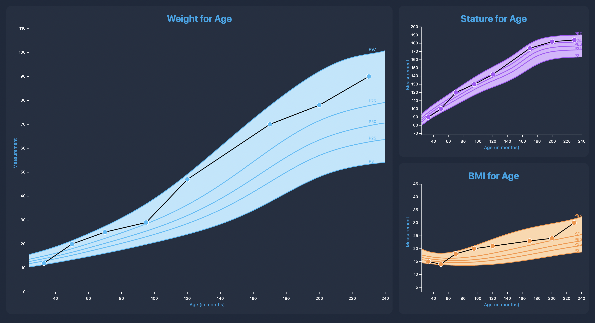

# Develo Growth Chart Calculation (Take Home)

This project is split into two sections, _client_ and _server_.

## Running the Server
The server is using Express with TypeScript and is being deployed as a Lambda with serverless.

To run the server, you will need to:
```shell
cd server
npm install
npm start
```

Once that is done, the server will start accepting HTTP requests at [http://localhost:3001/production](http://localhost:3001/production).

To calculate a Z score, you will need to send a POST request to [http://localhost:3001/production](http://localhost:3001/production) with a JSON body similar to:

```json
{
  "patient": {
    "sex": 1,
    "agemos": 12.5,
    "head_circumference": 20,
    "height": 36,
    "weight": 15,
    "bmi": 20
  },
  "attribute": "height"
}
```

`attribute` can be one of `height` | `weight` | `head_circumference` | `bmi`

### Deploying Server
This module is meant to be deployed as a Lambda utilizing serverless. When working locally, the module is already utilizing `serverless-offline`, this ensures that when you are ready to deploy, your environments are already similar between local and production.

When ready to deploy, you will need to make sure AWS credentials are set, then run:
```bash
npm run deploy
```

<hr />

## Running the Client



The frontend is bootstrapped using [Create React App](https://create-react-app.dev/).

To run the frontend, you will need to: 
```shell
cd client
npm install
npm start
```
Once that is done, the frontend can be accessed in the browser at [http://localhost:3000](http://localhost:3000).

**NOTE: You will need both the client and the server to be running in order to load the chart data**

### Running Test Suite
The frontend utilizes `jest` for snapshot testing. To run the test suite, run:
```bash
npm test
```